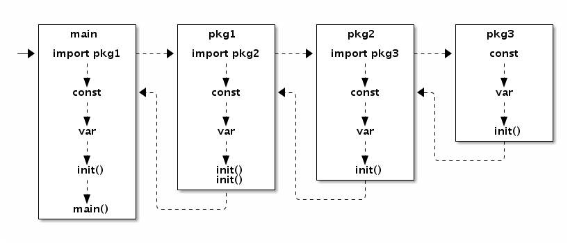

### 1. 同一个struct的两个实例可否用==比较？不同struct的两个实例可否用==比较？struct类型可否作为map的key？

+ 同一struct类型的两个实例，当结构体中不包含不可比较的类型（切片、map）时，可以使用==比较，否则不能使用==比较
+ 不同struct类型的两个实例不能用==比较，因为编译报错
+ 如果struct类型中只包含可比较类型则可以用作map的key，否则不行

### 2. GC（垃圾回收）及运行原理

使用算法：三色标记+混合写屏障+辅助gc

触发时机：

* 定时触发（每2分钟内未执行过gc）
* 分配内存时触发（当前内存是上一次gc执行完内存的两倍）
* 手动触发（runtime.GC()）

执行流程：

* gc初始化：收集根节点（全局对象、G Stack），开启写屏障，开启辅助GC（需要stw，但1.9版本之后已优化，不需要stw）
* 标记：初始时节点都为白色，从根节点出发，标记为灰色，然后放入灰色集合，然后从灰色集合拿出来一个将其标记为黑色，并将其引用的对象标记为灰色，并放入灰色集合，然后重复以上操作，直到灰色集合为空，此时要么是黑节点要么是白节点，白节点即为要清理的对象。（此阶段与用户代码并行）
* 标记结束：关闭写屏障和辅助GC（需要stw）
* 清理：清理白色节点（此阶段与用户代码并行）

辅助GC：当用户程序分配内存的速度比回收速度快时，辅助gc会执行stw停掉用户程序，用更多的cpu来跑垃圾回收程序。如果不这样，那么gc会一直卡在标记阶段，无法正常执行。

写屏障: 由于标记阶段,与用户代码并行,所以可能出现被引用的对象被标记为白色的问题。例如以下场景：

A首先被标记为黑色，B引用C，用户代码将B标记为黑色之前将引用给了C，这时B被标记为黑色，但是由于A已经被扫描过，所以A引用C不会再此被扫描，所以C会被标记成白色，但是应为黑色。

写屏障就是在标记阶段，与用户代码并行时，监控对象的状态，并重新标记。

流程图如下：


参考：

https://juejin.im/post/6844903793855987719

https://www.jianshu.com/p/e20aaa039229

http://yangxikun.github.io/golang/2019/12/22/golang-gc.html

### 3. Go调度器原理

+ GPM模型  

  一个G对应一个goroutine

  一个P对应一个逻辑处理器，并维护一个G的本地运行队列，数量与GOMAXPROCS数量一致，指最大并行数

  一个M对应一个内核线程，数量不固定，由go运行时指定，默认设置为最大10000.

  gorutine 与 内核线程 N:M映射

+ 全局运行队列

  go运行时会维护一个G的全局运行队列，p会在一定条件下，来全局运行队列中拿G放到自己的本地运行队列中。全局运行队列会使用mutex来控制多个p的并发访问。

  全局运行对列使用mutex来实现多个p的并发访问，由于锁的竞争太严重，所以每个p中引入了本地运行队列，以减少锁的竞争。

+ 本地运行队列

  每一个p都会维护一个G的本地运行队列，p会不断的在本地运行队列中取出G挂载到内核线程上去运行。当通过 `go` 关键字创建一个新的 goroutine 的时候，它会优先被放入 P 的本地队列。

+ netpoll（网络轮询器）

  比如select/poll/epoll等IO多路复用，goroutine将被挂起，直到IO事件触发，这是将goroutine重新放回运行队列中。

+ 调度过程

  p首先检查**本地运行队列**，如果本地运行队列为空，首先会去检查**全局运行队列**（需要加锁），如果全局运行队列也为空，然后去检查**网络轮询器**(network poller)中是否有IO事件被触发，如果还没有，这时会进行”**窃取**“，即去其他p的本地运行队列中拿一部分G放到自己的本地运行队列中。

+ sysmon

  go程序在启动时，会启动一个sysmon（系统监视器）的m，这个m无须与p绑定即可运行，每20us~10ms启动一次,它完成的工作主要有：

  - 释放闲置超过5分钟的span物理内存；
  - 如果超过2分钟没有**垃圾回收**，强制执行；
  - 将长时间未处理的netpoll结果添加到任务队列；
  - 向长时间运行的G任务发出**抢占调度**；
  - 收回因syscall长时间阻塞的P；

+ 抢占式调度

  当某个goroutine执行超过10ms，sysmon会向其发起抢占调度请求，goroutine调度没有时间片的概念，通过设置标记来进行抢占式操作。

  基于协作的抢占式调度器 - 1.2 ~ 1.13

  基于信号的抢占式调度器 - 1.14 ~ 至今

+ channel

  试图写入或读取channel而被阻塞的gorutine会被阻塞到channel中的sendq或recvq（写/读队列中），不会放到全局运行队列，或者p的本地运行队列中

+ 总结

  goroutine的调度不需要让 CPU **在用户态和内核态之间切换**，这种实现方式相比内核级线程可以做的很轻量级，对系统资源的消耗会小很多


参考：

https://tonybai.com/2020/03/21/illustrated-tales-of-go-runtime-scheduler/

https://tonybai.com/2017/06/23/an-intro-about-goroutine-scheduler/

https://wudaijun.com/2018/01/go-scheduler/

### 4. Slice底层结构及实现原理

```go
// runtime/slice.go
type slice struct {
    array unsafe.Pointer // 元素指针（底层数组）
    len   int // 长度 
    cap   int // 容量
}
```

+ 切片长度

  切片长度是切片引用的元素数目

+ 切片容量

  容量是底层数组的长度

+ slice作为参数传递

  当slice类型作为函数参数传递时，是以slice结构进行值拷贝进行传递（64位机器上为24个字节，32位机器上为12个字节），由于扩容时底层数组可能变化，即array指针地址会变，所以函数中如果有调用append函数对切片扩容，那么应传递切片指针作为参数。如：

  ```go
  func appendSlice(s *[]int) {
  	for i := 0; i < 1000; i ++ {
  		*s = append(*s, i)
  	}
  }
  ```

+ 扩容机制

  当切片容量小于1024时，则每次扩容2倍，当大于等于1024时，每次扩容上次的四分之一。扩容过程中底层数组可能发生变化。

+ nil 切片

  var slice1 []int   slice1 与 nil 比较结果为true，json.Marshal结果为null

+ 空切片

  slice2 := make([]int,0)   slice2 与 nil比较结果为false，json.Marshal结果为[]

+ 切片的切片操作

  切片操作并不复制切片指向的元素。它创建一个新的切片并复用原来切片的底层数组。 因此，通过一个新切片修改元素会影响到原始切片的对应元素。如下：

```go
func doAppend(a []int) {
	_ = append(a, 0)
}

func main() {
	s := []int{1,2,3,4,5,6,7,8,9}
	s2 := s[2:5]
	fmt.Println(s) // 输出 [1 2 3 4 5 6 7 8 9]
	fmt.Println(s2) // 输出 [3 4 5]
	s2[0] = 88
	s2[1] = 88
	s2[2] = 88
	fmt.Println(s) // 输出 [1 2 88 88 88 6 7 8 9]
	fmt.Println(s2) // 输出 [88 88 88]
    
	a := []int{1, 2, 3, 4, 5}
	doAppend(a[0:2]) // 未指定容量，由于切片操作复用原底层数组，所以append操作会直接修改原底层数组上的值
	fmt.Println(a) // 输出 [1 2 0 4 5]

	b := []int{1,2,3,4,5}
	doAppend(b[0:2:2]) // 指定容量，在append时，发现容量不足，则需要扩容，不会修改原底层数组上的值
	fmt.Println(b) // 输出 [1 2 3 4 5]
}
```

+ copy 函数 func copy(dst, src []Type) int

  copy函数是值拷贝，新的拷贝切片修改不会影响旧切片

  copy函数返回值是拷贝的字节数，等于min(len(src),len(dst))，如果dst拷贝前有值则被覆盖。

+ slice常用操作

  ```go
  //删除
  func remove(slice []interface{}, i int) []interface{} {
      return append(slice[:i], slice[i+1:]...)
  }
  
  //插入
  func insert(slice *[]interface{}, index int, value interface{}) {
      rear := append([]interface{}{}, (*slice)[index:]...)
      *slice = append(append((*slice)[:index], value), rear...)
  }
  
  //清空slice
  func empty(slice *[]interface{}) {
      //    *slice = nil
      *slice = append([]interface{}{})
  }
  ```

+ range

  使用range遍历切片，拿到的value时切片元素的值拷贝

+ 在循环中可使用s[0:0]复用切片，而不需要每次循环重新申请新的切片

  ```go
  func main() {
  	var s []int
  	for i := 0 ;i < 10; i++ {
  		if s != nil {
  			s = s[0:0] // 这里可以复用切片，否则就需要每一次循环都需要重新申请一个新的slice
  		}
  		for j := i; j < 10; j ++ {
  			s = append(s, j)
  		}
  		fmt.Println(s)
  	}
  }
  ```

### 5. Map 实现原理

hash函数往往存在输入范围大于输出范围的问题，所以会出现哈希冲突（哈希碰撞的问题），通常有以下解决方法

+ 哈希冲突（哈希碰撞）

  1. 开放寻址

  

  如上图，写如key3时，当hash函数命中key1时，就要线性往后查找第一个为空的位置，并存储key3。读取keys时，hash函数命中key1，此时就需要往后线性查找key3，直到找到或遇到空。

  2. 拉链法（golang map使用拉链法解决hash冲突）

     链表的数组

  

  如上图，key11经过hash函数命中2的位置，然后依次**遍历此桶中的链表**，如果找到key11，则对其进行更新操作，否则将key11添加到链表尾部。

  3. 再hash法

     当发生冲突时，使用第二个、第三个、哈希函数计算地址，直到无冲突。

+ golang map数据结构

  golang map的底层实现是哈希表，并采用拉链法解决哈希冲突

  ```go
  type hmap struct {
  	count     int  // 记录当前hash表元素数量
  	flags     uint8
            B         uint8 // 记录当前hash表中buckets的数量，由于hash表每次扩容2倍，所以存储的是对数形式，2^B = len(buckets)
  	noverflow uint16
  	hash0     uint32  // 传入hash函数，hash计算时使用
  
  	buckets    unsafe.Pointer
  	oldbuckets unsafe.Pointer // 用于hash扩容时，保存之前的buckets
  	nevacuate  uintptr
  
            extra *mapextra // 保存溢出数据的桶，数量是2 ^ (B-4)
  }
  ```

  

+ hash表扩容

  当hash表中的元素越来越多时，hash冲突的概率就会越来越高，hash表中桶的链表会越来越长，导致遍历链表耗时变长，这时就需要hash表扩容，一般每次扩容两倍。

  + 渐进式rehash

    map在rehash时，和redis一样采用渐进式rehash，使用oldbuckets字段保存旧的hash表，不一次性迁移完所有的buckets，而是把key的迁移分摊到每次的插入和删除操作中，在全部迁移完成后，释放oldbuckets。

  + 读取数据

    在扩容期间会发生读oldbuckets的情况，如果oldbuckets还未迁移完成则读oldbuckets

  + 触发扩容时机

    1. 装载因子大于6.5（即每个桶平均存储6.5个key，通常每个桶最大为8）（装载因子：元素数量/桶数量）
    2. 哈希使用了太多的溢出桶（当hash冲突数超过桶最大数量时，会存储在溢出桶中，并形成一个链表）

参考：

https://juejin.im/entry/6844903793927143438

https://juejin.im/post/6844903940866179079#heading-3

https://juejin.im/post/6844904078636482574#heading-15

### 6. init 函数执行顺序

- 在同一个go文件中，可以定义多个init方法，按照在代码中编写的顺序依次执行不同的init方法
- 在同一个package中，可以多个文件中定义init方法，不同文件中的init方法的执行`按照文件名先后`执行各个文件中的init方法
- 对不同package，如果没有依赖关系，则按照main包中import的顺序执行init()，如果存在依赖关系，则最早被依赖的包最早执行init()

下图为常量、全局变量、init函数、main函数的执行顺序图，main函数最后执行：




### 7. new和make区别

+ new(T)返回T类型的指针，make(T)返回T类型
+ new只分配内存，make分配内存并初始化
+ new可用于任意类型，make仅用于slice、channel、map

### 8. nil可与哪些类型比较？

+ 引用类型：channel、slice、map、接口、函数、指针

只有引用类型才可以与nil进行比较

### 9. Sync.Map 实现原理

数据结构

```go
type Map struct {
    //互斥锁，用于锁定dirty map
    mu Mutex    
    
    //优先读map,支持原子操作，注释中有readOnly不是说read是只读，而是它的结构体。read实际上有写的操作
    read atomic.Value 
    
    // dirty是一个当前最新的map，允许读写
    dirty map[interface{}]*entry 
    
    // 主要记录read读取不到数据加锁读取read map以及dirty map的次数，当misses等于dirty的长度时，会将dirty复制到read
    misses int 
}

// readOnly 主要用于存储，通过原子操作存储在 Map.read 中元素。
type readOnly struct {
    // read的map, 用于存储所有read数据
    m       map[interface{}]*entry
    
    // 如果数据在dirty中但没有在read中，该值为true,作为修改标识
    amended bool 
}

// entry 为 Map.dirty 的具体map值
type entry struct {
    // nil: 表示为被删除，调用Delete()可以将read map中的元素置为nil
    // expunged: 也是表示被删除，但是该键只在read而没有在dirty中，这种情况出现在将read复制到dirty中，即复制的过程会先将nil标记为expunged，然后不将其复制到dirty
    //  其他: 表示存着真正的数据
    p unsafe.Pointer // *interface{}
}
```

逻辑流程图


`sync.Map` 的实现原理可概括为：

- 两个map一个read一个dirty
- 读取时优先从read map中读取，如果读取不到则去dirty map中读取（dirty map中也不一定存在），并记录miss次数，如果miss次数等于dirty map 长度，则将dirty map的数据覆盖read map的数据（dirty map 提升为read map），同时dirty map置空，miss次数置0。
- 写入数据时，如果read map中存在写入键，则直接更新read map中的键值。如果不存在，则去检查dirty map中是否存在，如果存在则更新，如果不存在，则写入dirtymap，如果这时dirty map为nil，会将read map中的数据复制到dirtymap
- 注意read map也会有写操作（不会加锁），并不是只读。
- 如果dirty map和read map中含有相同的key，那么修改其中一个map中这个key的值，另一个map中这个key的值也会发生变化，因为value存的是指针。
- 对于删除数据则直接通过标记来延迟删除

参考：

https://juejin.im/post/6844904100287496206

### 10. Chanel 底层原理

+ 数据结构

  ```go
  type hchan struct {
  	qcount   uint           // 循环队列中的元素数量
  	dataqsiz uint           // 循环队列的长度
  	buf      unsafe.Pointer // 指向循环队列（循环数组）的指针，只针对有缓冲的channel
  	elemsize uint16     // 元素大小
  	closed   uint32       // channel是否关闭的标志
  	elemtype *_type // 元素类型
  	sendx    uint   // 记录循环队列中发送操作处理到的位置（索引）
  	recvx    uint   // 记录循环队列中接收操作处理到的位置（索引）
  	recvq    waitq  // 存储了当前channel读阻塞的goroutine列表（双向链表）
  	sendq    waitq  // 存储了当前channel写阻塞的goroutine列表（双向链表）
  	lock mutex  // 互斥所，保护channel中所有字段，还有一些阻塞在当前channel上sudogs中的一些字段
  }
  
  type waitq struct {
  	first *sudog  // 指向双向链表第一个节点
  	last  *sudog // 指向双向链表最后一个节点
  }
  
  //  sudog代表一个在等待队列中的goroutine
  type sudog struct {
  	g *g
  
  	next *sudog  // 双向链表后指针
  	prev *sudog // 双向链表前指针
  	elem unsafe.Pointer // data element (may point to stack)
  
  	acquiretime int64
  	releasetime int64
  	ticket      uint32
      
  	isSelect bool
  
  	parent   *sudog // semaRoot binary tree
  	waitlink *sudog // g.waiting list or semaRoot
  	waittail *sudog // semaRoot
  	c        *hchan // channel
  }
  ```

  循环队列（数组）+ 双向链表（读阻塞）+双向链表（写阻塞）

+ 为什么channel是引用类型

  在编译阶段，make(chan int, 10)中的make函数会被转换为runtime.makechan或runtime.makechan64函数，同时，返回一个hchan结构体的指针。

+ 写channel或者读channel为什么是线程安全的

  在写channel或读channel时，都会使用hchan结构体中的lock进行并发控制（加锁）

+ 写channel过程

  1. 首先使用hchan.lock对结构体加锁
  2. 将数据从goroutine拷贝到hchan.buf即循环队列中
  3. 释放锁

+ 读channel过程

  1. 首先使用hchan.lock对结构体加锁
  2. 将数据hchan.buf中的头元素，拷贝到goroutine中
  3. 释放锁

+ G1写一个缓冲区为3的channel过程中，缓冲区被写满之后，再次写入发生了什么

  1. channel调用go调度器(gopark函数)，让G1等待，并且G1让出M，让其他goroutine运行。
  2. 同时G1会被抽象为sudog结构体保存到channel中的sendq队列中，等待被唤醒
  3. 当有其他goroutine读channel时，这时channel就会将sendq中的G1推出，调用go调度器（goready函数），将G1放入到P的运行队列中，等待被调度运行。

+ G2读一个缓冲区为3的channel时，缓冲区无数据，是如何进入阻塞和被唤醒的

  1. 当G2读取channel时，发现channel中无数据，channel会调用go调度器(gopark函数)，使G2等待，G2让出M，让其他goroutine运行
  2. 同时G2会被抽象为sudog结构体并保存在channel中的recvq队列中，等待被唤醒
  3. 当有其他goroutine向channel写入数据后，此时channel会将G2从recvq中推出G2，并调用go调度器（goready函数），将G2放到P的运行队列中，等待被调度运行。

+ 注意

  1. 向已经关闭的channel写入数据，会panic
  2. 关闭已经关闭的channel会panic
  3. range channel时，如果channel不被close，会一直阻塞

+ 判断channel关闭

  ```go
  //  一般用法
  _, ok := <-ch
  if !ok {
  	fmt.Println("closed 1")
  }
  
  // 通过偏移
  func isChanClosed(ch interface{}) bool {
  	cptr := *(*uintptr)(unsafe.Pointer(
  		unsafe.Pointer(uintptr(unsafe.Pointer(&ch)) + unsafe.Sizeof(uint(0))),
  	))
  
  	cptr += unsafe.Sizeof(uint(0))*2
  	cptr += unsafe.Sizeof(unsafe.Pointer(uintptr(0)))
  	cptr += unsafe.Sizeof(uint16(0))
  	return *(*uint32)(unsafe.Pointer(cptr)) > 0
  }
  ```

参考：

https://juejin.im/post/6844903821349502990

https://learnku.com/articles/32142

https://draveness.me/golang/docs/part3-runtime/ch06-concurrency/golang-channel/

### 8. defer 

+ 数据结构

  ```go
  type _defer struct {
  	siz     int32
  	started bool
  	sp      uintptr
  	pc      uintptr
  	fn      *funcval
  	_panic  *_panic
  	link    *_defer  // 链表指针
  }
  ```

  

  多个defer会形成一个链表，后面声明的defer会放到链表的头部,运行时，从前向后运行。


+ defer 一般用于资源释放，如下

```go
f,err := os.Open(filename)
if err != nil {
    panic(err)
}
defer f.Close()
```

+ 多个defer，执行顺序类似于栈（后进先出），下面的先执行

+ defer 与 return的执行顺序

  1. 返回值=x
  2. 执行defer语句
  3. 空的return

  如以下几个例子

  ```go
  // 例1
  func f() (result int) {
      defer func() {
          result++
      }()
      return 0
  }
  
  // 可改写为
  func f() (result int) {
      result = 0
      defer func() {
          result++
      }()
      return
  }
  // 所以例1返回1
  
  //============================================================
  
  // 例2
  func f() (r int) {
       t := 5
       defer func() {
         t = t + 5
       }()
       return t
  }
  // 可改写为
  func f() (r int) {
       t := 5
       r = t
       defer func() {
         t = t + 5
       }()
       return
  }
  // 因为t赋值给r后，defer语句中并不会改变r的值，所以返回5
  
  //============================================================
  
  // 例3
  func f() (r int) {
      defer func(r int) {
            r = r + 5
      }(r)
      return 1
  }
  // 可改写为
  func f() (r int) {
      r = 1
      defer func(r int) {
            r = r + 5
      }(r)
      return
  }
  // 因为r被赋值为1后，defer语句是用的是r的拷贝（值传递），所以r的值不会发生变化，返回值为1
  
  ```

+ 被deferred的函数的参数在defer时确定

  

  ```go
  // 以下函数目的是计算函数执行时间，但是这么写达不到目的
  func foo() {
  	t0 := time.Now()
  	defer fmt.Println(time.Now().Sub(t0))
  	
  	for i := 0; i < 100; i++ {
  		fmt.Println(i)
  	}
  }
  
  // 可改为
  func foo() {
  	t0 := time.Now()
  	defer func() {
  		fmt.Println(time.Now().Sub(t0))
  	}()
  
  	for i := 0; i < 100; i++ {
  		fmt.Println(i)
  	}
  }
  // =====================================================================
  // 以下函数输出0，而不是1，因为defer时已经确定参数i=0，后面不会发生改变
  func a() {
      i := 0
      defer fmt.Println(i)
      i++
      return
  }
  ```

+ defer不是退出代码块时执行，而是当前函数return之前运行

  ```go
  func main() {
      {
          defer fmt.Println("defer runs")
          fmt.Println("block ends")
      }
      
      fmt.Println("main ends")
  }
  
  // 输出
  // block ends
  // main ends
  // defer runs
  ```

  

参考：

https://tiancaiamao.gitbooks.io/go-internals/content/zh/03.4.html

https://sanyuesha.com/2017/07/23/go-defer/

https://draveness.me/golang/docs/part2-foundation/ch05-keyword/golang-defer/

### 9. select， *select是随机的还是顺序的？*


### 10. context


### 11. Map 如何顺序读取


### 12. Golang内存泄漏，线上如果出现如何排查解决


### 13. Slice常见坑，len，cap，扩容等


### 14. 反射


### 15. sync.Pool用过吗，为什么使用，对象池，避免频繁分配对象（GC有关），那里面的对象是固定的吗？


### 16.  goroutine泄漏有没有处理


### 17. go使用踩过什么坑


### 18. go优缺点


### 19. go的值传递和引用


### 20. go的锁如何实现，用了什么cpu指令


### 21. go的runtime如何实现


### 22. go什么情况下会发生内存泄漏？


### 23. 怎么实现协程完美退出？


### 24. 用channel实现定时器？


### 25. 怎么理解go的interface


### 26. c++ 和 go对比


### 28. go怎么从源码编译到二进制文件


### 29. go函数中，返回值未命名，发生了panic，但是在函数内recover了。函数返回什么值？


### 30. *Go语言局部变量分配在栈还是堆？*


