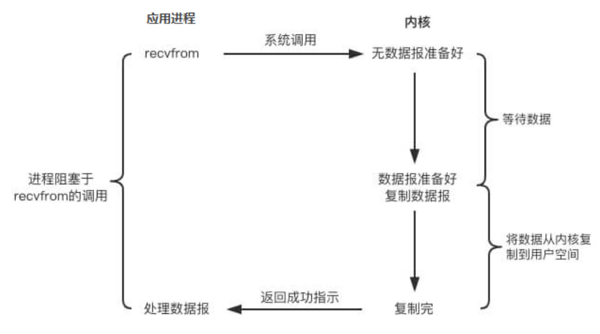
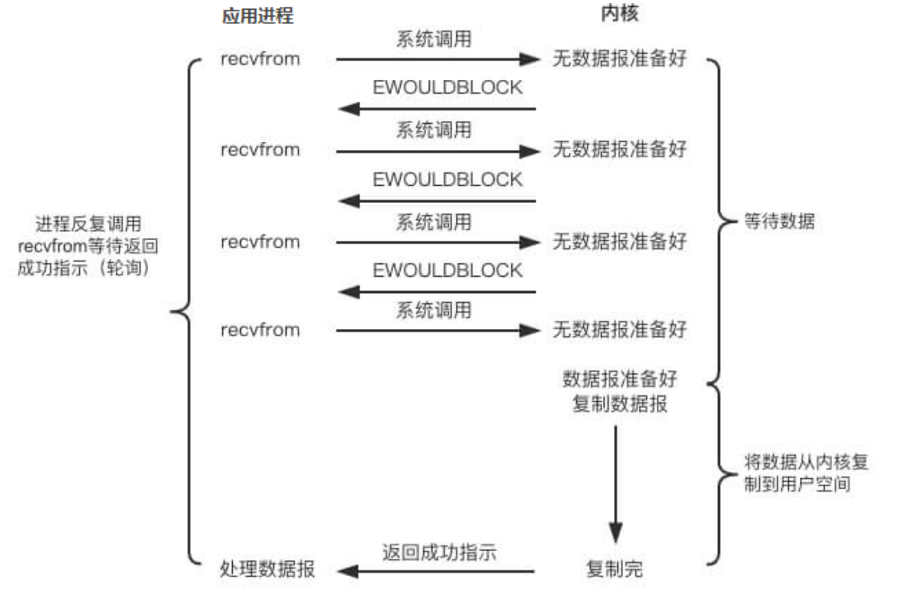
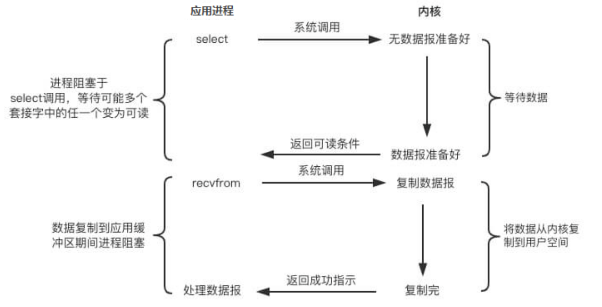
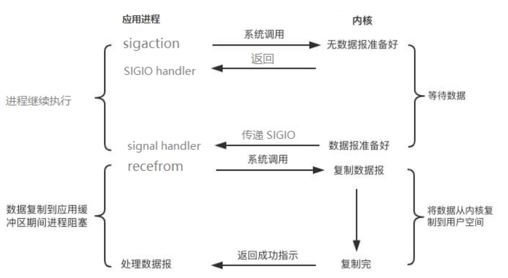
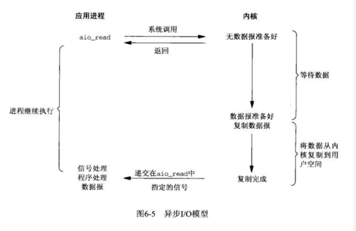
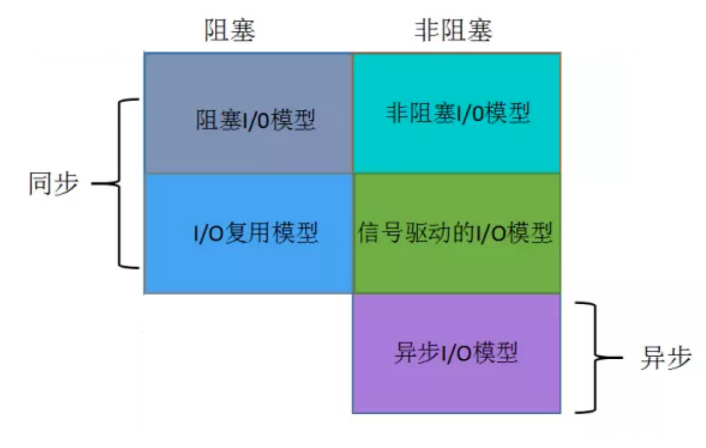
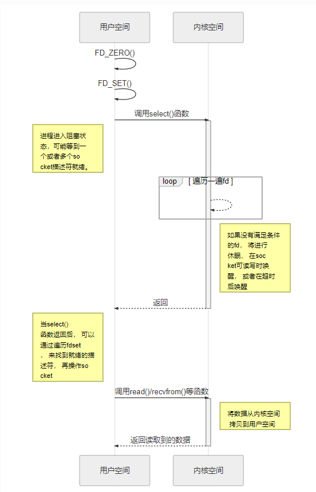

### 1. 孤儿进程，僵尸进程


### 2. 进程、线程、协程


### 3. 父进程与子进程之间的关系是怎样的


### 4. 死锁条件，如何避免


### 5. 进程虚拟空间分布，全局变量放哪里？


### 6. I/O模型

+ 阻塞I/O

  读写文件，网络I/O。当发生读写文件或网络I/O读写时，操作会阻塞当前线程，直到完成I/O操作，才能继续向下执行。

  一般采用多进程或多线程的方式来解决此类问题，但是由于过多的进程或过多的线程都会造成大量的资源浪费，并且多线程上下文切换，也会带来很大的开销

  

  执行流程：

  	1. 应用程序调用recvform()系统调用函数，进入内核空间
   	2. 内核空间等待数据准备好
   	3. 内核空间将数据从内核空间拷贝到用户空间
   	4. 应用程序拿到数据进行后续处理

  总结：

  ​	上述整个过程，当前用户线程是阻塞等待的。

+ 非阻塞I/O

  当应用程序调用系统调用函数，进入到内核空间后，如果内核空间数据没有准备好，那么此时内核空间之间返回给用户空间一个错误，此时用户空间不需要等待内核空间数据准备好，而可以去执行其他工作代码，然后定期轮询，查看内核空间是否准备好了，如果准备好，将内核空间中的数据拷贝到用户空间，应用收到数据后，继续执行后续的工作。

  

  执行过程：

   1. 应用程序发起系统调用，进入到内核空间

   2. 如果内核空间数据还没准备好，则直接返回error。

   3. 应用程序会定时轮询，数据是否准备好了

   4. 数据准备好之后，则将数据从内核空间拷贝到用户空间

   5. 应用程序拿到数据之后，进行后续处理

      总结：

      不管内核空间数据是否准备好，都直接返回，然后应用程序定时轮询内核空间，数据是否准备好，准备好之后则将数据从内核空间拷贝到用户空间。

  

+ IO多路复用

  一个线程可以监听多个I/O事件，当有事件就绪时，可以通知线程执行响应的工作代码。

  

  执行过程：

  	1. 应用程序调用select系统调用函数，并将fd_set从用户空间拷贝到内核空间，然后在内核空间中对fd_se遍历一遍，如果没有就绪的I/O事件，则内核进行休		眠，当有就绪的事件时，则唤醒内核
   	2. 通知用户线程就绪事件的数量
   	3. 就绪数量大于0时，select再遍历一次fd_set，找出就绪的事件
   	4. 然后再执行相应的操作。比如：应用程序调用recvfrom系统调用，进入内核空间，内核将数据拷贝到用户空间进行后续处理

  总结：

  ​	多路复用本质也是同步I/O

+ 信号驱动I/O

  用户进程向内核发送一个信号，告诉内核需要什么样的数据，然后用户进程就可以去干其他工作了，当内核数据准备好后，就会给用户进程发送一个信号，去执行相应的读写操作。

  

  执行过程：

  	1. 首先用户进程调用sigaction系统调用，告知内核需要什么数据，并返回一个sigio handler，用户进程就可以接着去干其他事儿了
   	2. 当内核数据准备好后，会给用户进程发送一个信号
   	3. 用户进程收到信号后，接着调用recvfrom系统调用，进入内核空间
   	4. 内核将数据拷贝到用户空间，进行后续处理

  

+ 异步I/O

  用户调用aio_read系统调用之后，无论内核是否准备好数据，都直接返回，当内核数据准备好之后，内核直接将数据拷贝到用户空间。

  

  执行过程：

  	1. 用户进程调用aio_read系统调用
   	2. 内核无论是否准备好数据直接返回
   	3. 当内核数据准备好后，直接将数据拷贝到用户空间

  总结：

  ​	异步I/O每个阶段都是非阻塞的

+ 总结

  

参考：

https://www.cnblogs.com/sheng-jie/p/how-much-you-know-about-io-models.html

https://tutorial.linux.doc.embedfire.com/zh_CN/latest/system_programing/socket_io.html

https://www.cnblogs.com/f-ck-need-u/p/7624733.html

### 7. IO多路复用，select、poll、epoll区别

+ IO多路复用是一种同步IO模型，一个线程监听多个IO事件，当有IO事件就绪时，就会通知线程去执行相应的读写操作，没有就绪事件时，就会阻塞交出cpu。多路是指网络链接，复用指的是复用同一线程。

+ select

  + fd_set数据结构定义如下，可以看出fd_set是一个整型**数组**，用于保存socket文件描述符

  ```c
  typedef long int __fd_mask;
  
  /* fd_set for select and pselect.  */
  typedef struct
    {
  #ifdef __USE_XOPEN
      __fd_mask fds_bits[__FD_SETSIZE / __NFDBITS];
  # define __FDS_BITS(set) ((set)->fds_bits)
  #else
      __fd_mask __fds_bits[__FD_SETSIZE / __NFDBITS];
  # define __FDS_BITS(set) ((set)->__fds_bits)
  #endif
    } fd_set;
  ```

  + 执行过程

    

    流程：

    	1. 用户线程调用select，将fd_set从用户空间拷贝到内核空间
     	2. 内核在内核空间对fd_set遍历一遍，检查是否有就绪的socket描述符，如果没有的话，就会进入休眠，直到有就绪的socket描述符
     	3. 内核返回select的结果给用户线程，即就绪的文件描述符数量
     	4. 用户拿到就绪文件描述符数量后，再次对fd_set进行遍历，找出就绪的文件描述符
     	5. 用户线程对就绪的文件描述符进行读写操作

  + 优点

    1. 所有平台都支持，良好的跨平台性

  + 缺点

    1. 每次调用select，都需要将fd_set从用户空间拷贝到内核空间，当fd很多时，这个开销很大
    2. 最大连接数（支持的最大文件描述符数量）有限制，一般为1024
    3. 每次有活跃的socket描述符时，都需要遍历一次fd_set，造成大量的时间开销，时间复杂度是O(n)
    4. 将fd_set从用户空间拷贝到内核空间，内核空间也需要对fd_set遍历一遍

+ poll

  + 数据结构

    数据结构定义如下，**链表**存储

    ```c
    /* Data structure describing a polling request.  */
    struct pollfd
      {
        int fd;			/* File descriptor to poll.  */
        short int events;		/* Types of events poller cares about.  */
        short int revents;		/* Types of events that actually occurred.  */
      };
    ```

  + 与select的异同点

    相同点：

    1. 内核线程都需要遍历文件描述符，并且当内核返回就绪的文件描述符数量后，还需要遍历一次找出就绪的文件描述符
    2. 需要将文件描述符数组或链表从用户空间拷贝到内核空间
    3. 性能开销会随文件描述符的数量而线性增大

    不同点：

    1. select存储的数据结构是文件描述符数组，poll采用链表
    2. select有最大连接数限制，poll没有最大限制，因为poll采用链表存储

  + 执行过程（基本与select类型）

    1. 用户线程调用poll系统调用，并将文件描述符链表拷贝到内核空间
    2. 内核对文件描述符遍历一遍，如果没有就绪的描述符，则内核开始休眠，直到有就绪的文件描述符
    3. 返回给用户线程就绪的文件描述符数量
    4. 用户线程再遍历一次文件描述符链表，找出就绪的文件描述符
    5. 用户线程对就绪的文件描述符进行读写操作

+ epoll

  + 核心代码

    ```c
    #include <sys/epoll.h>
    
    // 数据结构
    // 每一个epoll对象都有一个独立的eventpoll结构体
    // 红黑树用于存放通过epoll_ctl方法向epoll对象中添加进来的事件
    // epoll_wait检查是否有事件发生时，只需要检查eventpoll对象中的rdlist双链表中是否有epitem元素即可
    struct eventpoll {
        ...
        /*红黑树的根节点，这颗树存储着所有添加到epoll中的需要监控的事件*/
        struct rb_root  rbr;
        /*双链表存储所有就绪的文件描述符*/
        struct list_head rdlist;
        ...
    };
    
    // API
    int epoll_create(int size); // 内核中间加一个 eventpoll 对象，把所有需要监听的 socket 都放到 eventpoll 对象中
    int epoll_ctl(int epfd, int op, int fd, struct epoll_event *event); // epoll_ctl 负责把 socket 增加、删除到内核红黑树
    int epoll_wait(int epfd, struct epoll_event * events, int maxevents, int timeout);// epoll_wait 检测双链表中是否有就绪的文件描述符，如果有，则返回
    
    ```

    核心点：

    1. epoll_create创建eventpoll对象（红黑树，双链表）
    2. 一棵红黑树，存储监听的所有文件描述符，并且通过epoll_ctl将文件描述符添加、删除到红黑树
    3. 一个双链表，存储就绪的文件描述符列表，epoll_wait调用时，检测此链表中是否有数据，有的话直接返回
    4. 所有添加到eventpoll中的事件都与设备驱动程序建立回调关系

  + 缺点

    1. 只能工作在linux下

  + 优点

    1. 时间复杂度为O(1)，当有事件就绪时，epoll_wait只需要检测就绪链表中有没有数据，如果有的话就直接返回
    2. 不需要从用户空间到内核空间频繁拷贝文件描述符集合，使用了内存映射(mmap)技术
    3. 当有就绪事件发生时采用回调的形式通知用户线程

+ select、poll、epoll的区别

  |                            | select                                               | poll                                               | epoll                                                        |
  | -------------------------- | ---------------------------------------------------- | -------------------------------------------------- | ------------------------------------------------------------ |
  | 底层数据结构               | **数组**存储文件描述符                               | **链表**存储文件描述符                             | **红黑树**存储监控的文件描述符，**双链表**存储就绪的文件描述符 |
  | 如何从fd数据中获取就绪的fd | 遍历fd_set                                           | 遍历链表                                           | 回调                                                         |
  | 时间复杂度                 | 获得就绪的文件描述符需要遍历fd数组，O(n)             | 获得就绪的文件描述符需要遍历fd链表，O(n)           | 当有就绪事件时，系统注册的回调函数就会被调用，将就绪的fd放入到就绪链表中。O(1) |
  | FD数据拷贝                 | 每次调用select，需要将fd数据从用户空间拷贝到内核空间 | 每次调用poll，需要将fd数据从用户空间拷贝到内核空间 | 使用内存映射(mmap)，不需要从用户空间频繁拷贝fd数据到内核空间 |
  | 最大连接数                 | 有限制，一般为1024                                   | 无限制                                             | 无限制                                                       |

  

+ epoll 的水平触发（LT）和边缘触发（ET）的区别

  LT模式：只要文件描述符还有数据可读，每次epoll_wait就会返回它的事件（**只要有数据就触发**）

  ET模式：只有数据流到来的时候才触发，不管缓冲区是否还有数据（**只有数据流到来才会触发**）

+ nginx和redis所使用的IO模型是什么

  IO多路复用
  
+ 应用场景

  1. 连接数较少并且都很活跃,用select和poll效率更高
  2. 连接数较多并且都不很活跃,使用epoll效率更高

参考：

https://juejin.im/post/6844904200141438984

https://tutorial.linux.doc.embedfire.com/zh_CN/latest/system_programing/socket_io.html

https://www.cnblogs.com/sheng-jie/p/how-much-you-know-about-io-models.html

https://blog.csdn.net/daaikuaichuan/article/details/83862311

### 8. 程序运行的用户空间和内核空间，如何进行数据拷贝


### 9. 零拷贝


参考：

https://blog.biezhi.me/2019/01/zero-copy-user-mode-perspective.html


### 10. TCP传输需要几次拷贝


参考：

https://www.cnblogs.com/f-ck-need-u/p/7624733.html


### 8. cap原则


### 9. 操作系统内存管理？进程通讯，为什么共享存储区效率最高


### 10. ipc方式，共享存储区原理


### 11. 进程虚拟空间布局


### 12. 进程状态转换


### 13. 线程的栈在内存什么位置


### 14. 线程自己独享什么


### 15. 讲一下线程参数的含义


### 16. 操作系统虚拟内存换页的过程


### 17. 乐观锁、悲观锁、互斥锁、读写锁的原理实现与区别


### 18. 讲一下多线程与多进程区别


### 19. 用过哪些命令


### 20. top 命令之后有哪些内容，有什么作用。


### 21. 线程的生命周期


### 22. free -h，buffers 和cached有什么不同


### 23. 一个进程有20个线程，在某个线程中调用fork，新的进程会有20个线程吗？


### 24. IO密集型与CPU密集型区别


### 25. 虚拟内存


