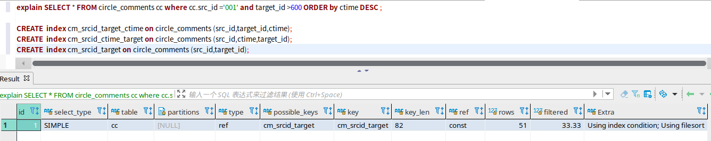
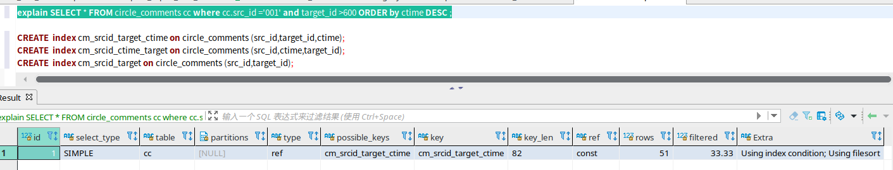
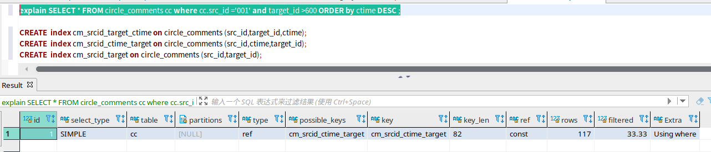
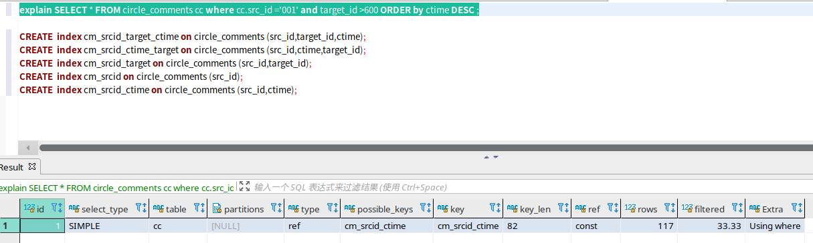

### 1. 为什么数据库生产环境最好不要使用外键

常用的外键类型：

+ RESTRICT：会触发一致性检查

  例如：
      cities表中字段有id、name两个字段

  ​	buildings表有id、name、city_id三个字段。

  ​    这时city_id就是关联到cities表的RESTRICT外键。

  ​	当向buildings表中新插入一条记录（88, "故宫", 9）时，就需要去cities表中检测是否有id=9的城市，如果没有则会报错。

  ​    当修噶buildings表中city_id的值时，需要检查cities表中是否存在这个id，如果没有则会报错。

  ​	当删除cities表中的id=7的城市时，需要检测buildings表中是否有引用city_id=7的记录，如果有则会报错。

+ CASCADE：会触发级联操作

  例如：

  ​	cities表中字段有id、name两个字段

  ​	buildings表有id、name、city_id三个字段。

  ​    这时city_id就是关联到cities表的CASCADE外键。

  ​	当删除cities表中的id=7的城市，那么会去检查buildings表中是否有引用city_id=7的记录，如果有则会将他们也删除。

  ​	当修改cities表中的id=8的城市，将它的id修改为11时，buildings表中引用city_id=8的记录，也会被修改为11

  

  **总结**

  - 使用外键：
    1. 可通过数据库外键特性保证数据一致性，但是可能会给数据库增加负载。

  - 不使用外键：
    1. 对于高并发的系统，使用外键会给数据库带来巨大的压力，所以生产环境一般不会使用外键
    2. 一致性检查、级联操作，由代码实现，会牺牲掉一部分一致性，但是可以给数据库减负

### 2. Mysql 为什么使用B+树作为索引的底层数据结构

B+树结构：

   			1. 每个节点有n个key，同时有n个子树
            			2. 非叶子结点只用做索引，不保存数据，叶子结点保存数据（把结点大小设置为磁盘页大小（4K），利于磁盘读写，减少IO消耗）
                  			3. 叶子结点形成链表 （利于范围查找）

为什么不用B树？

1. 因为数据库数据存储在磁盘上，查询时需要将磁盘中数据加载到内存中，而计算机读取文件到内存是以磁盘页为单位进行加载的。磁盘页大小固定，一般为4K。B树非叶子结点也存储数据，而B+树非叶子结点不存储数据。则意味着，使用B树，一个磁盘页能读到的节点数更少，B+树更多，从而使用B+树会使IO次数更少，B树更多，所以B+树更适用于磁盘读写的场景
2. B+树叶子结点形成链表，更利于范围查找，而B树则需要遍历树结构进行范围查找，性能不如B+树。
3. 由于B+树所有数据存储在叶子结点，所以查询时间复杂度稳定O(log n)，查询次数即树的高度，而B树非叶子结点也存储数据，所以查询效率不固定。

为什么不用哈希表？

1. 哈希表对于单个数据的增删改查时间复杂度是O(1)，但是不利于范围查找，会导致全表扫描

### 3. Mysql的索引有几种，时间复杂度

### 4. InnoDb是表锁还是行锁，为什么

### 5. 唯一索引和主键索引

### 6. 什么是主键６２、联合索引和唯一索引

### 7. 越多的索引越好吗？

### 8. 建立索引要注意什么？

### 9. 数据库隔离级别，分别会造成什么样的问题

### 10. mysql高可用的方案

### 11. 慢查询

### 12. 看过sql的连接池实现吗

### 13. Innodb的索引实现

### 14. innodb与myisam的区别

### 15. 从innodb的索引结构分析，为什么索引的 key 长度不能太长

### 16. MySQL的数据如何恢复到任意时间点

### 17. 组合索引的最左前缀原则的含义？

### 18. 数据库的事务实现原理、操作过程、如何做到事物之间的独立性等问题

### 19. 使用int 做primary key和使用string 有什么优劣？

### 20. 数据库分表的方法？

### 21. B+树做索引时，B+树通常高度为多少层？要参考哪些条件？

### 22. drop,delete与truncate的区别

### 23. 数据库范式

### 24. 数据库优化的思路

### 25. MVCC

### 26. explain

### 27. where a=1  and b<2 order by c desc 如何建索引

+ (a,b)联合索引会触发filesort

  

+ (a,b,c)联合索引会触发filesort

  

+ (a,c,b)联合索引无filesort，但b无法使用索引（如果target_id用上索引，rows应为51，由于sql执行顺序）

  

+ 所以结论是：建立(a,c)联合索引为最优解

  

### 28. 事务实现原理

### 29. binlog用处

### 30. 事务执行不完，会不会写binlog

### 31. 什么是全文索引

+ 全文索引（Full Text Index）就是**关键字搜索**

+ 举例

  比如有一个文章表contents，其中有id，content，create_time等字段，对content字段建立全文索引，然后使用SELECT * FROM contents WHERE **MATCH**(content) **AGAINST**('哈哈')。就是在查找content中含有“哈哈”关键字的行。

### 32. 事务隔离级别为可重复读时，当两个事务同时修改同一条记录中同一个字段（比如同一个用户的余额度）时，会发生什么？

+ 后修改的事务会等待前一个事务commit或者rollback才能进行修改，否则会一直等待直到超时。（这时应该是触发了行锁）
+ 即使修改的是同一行的不同字段，也会等待直到超时或者另一个事务提交或回滚。
+ 修改不同行记录，不需要等待

