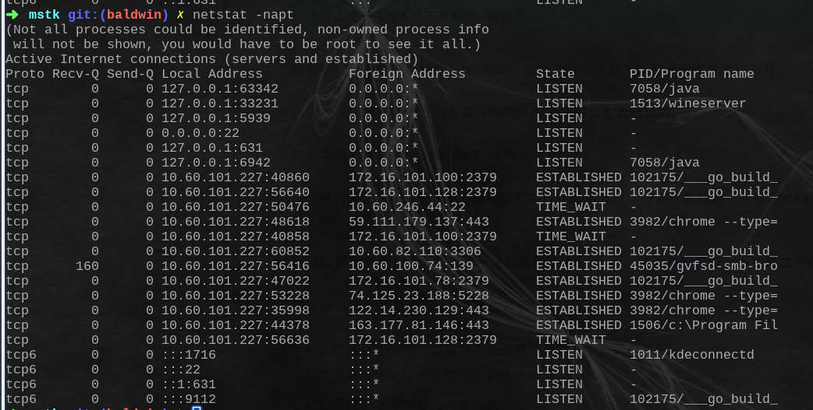
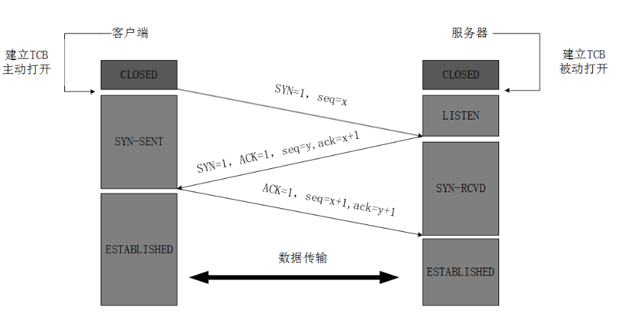
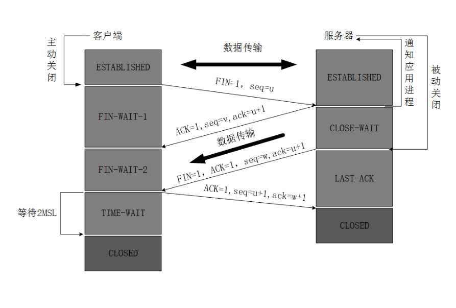
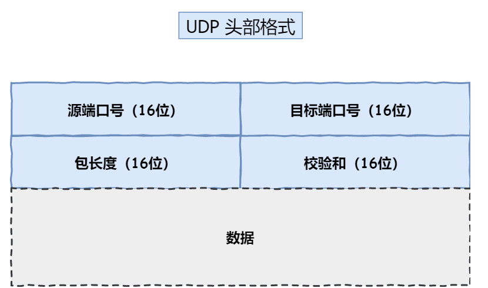
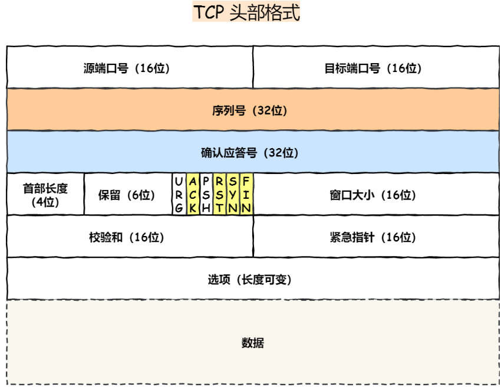
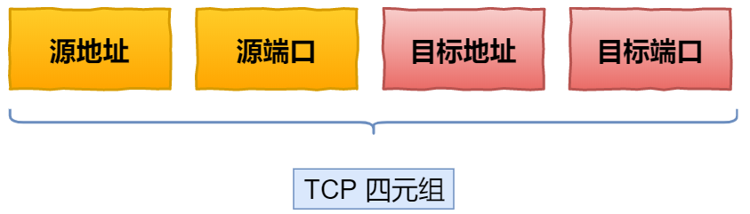
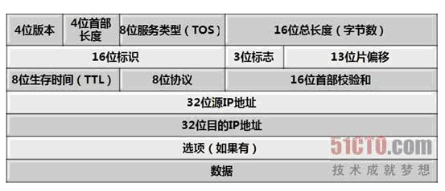

### 1. TCP定义

TCP是面向连接的、可靠的、基于字节流的传输层通信协议 。

### 2. 什么是TCP连接

用于保证可靠性和流量控制的某些状态信息的组合，包括socket、序列号、窗口大小等

### 3. TCP与UDP区别，UDP优点，适用场景

+ 区别

  + 连接

    TCP是面向连接的传输层协议，通信之前需要建立连接

    UDP传输时不需要建立连接

  + 服务对象

    TCP只能一对一通信

    UDP支持一对一、一对多、多对多

  + 可靠性

    TCP保证数据传输的可靠性

    UDP不保证传输的可靠性

  + 拥塞控制、流量控制

    TCP有拥塞控制和流量控制的机制

    UDP没有

  + 首部开销

    TCP首部20个字节（不使用选项字段20字节、使用时更长），UDP首部只有8个字节，长度固定

+ 应用案例

  + TCP
    + FTP文件传输
    + HTTP/HTTPS
  + UDP
    + DNS
    + 视频、音频等多媒体通信

参考：

https://www.cnblogs.com/xiaolincoding/p/12638546.html

### 4. Linux查看TCP连接状态

+ 命令

  netstat -napt

+ 图

  

### 5. TCP 三次握手过程及中间状态

+ 执行流程图

  

  + 过程描述
    + 客户端向服务端发送SYN=1（同步位），ACK=0（确认位），seq=x（随机序号）的包，并进入SYN_SENT状态（TCP规定报文段SYN=1且ACK=0表明这是一个请求建立链接的报文，不能携带数据）
    + 服务端收到连接请求后向客户端发送SYN=1（同步位），ACK=1（确认位），seq=y（序号），ack=x+1（确认号）,并进入SYN_RECV状态（TCP规定SYN=1且ACK=1的报文段为同意建立链接的响应报文，不能携带数据）
    + 客户端收到响应报文后，向服务端回复确认ACK=1（确认位），seq=x+1（序号），ack=y+1（确认号），客户端进入ESTABLISHED状态（这个ACK报文可以携带数据，如果不携带数据则不消耗序号）
    + 服务端进入ESTABLISHED状态

参考：

https://www.cnblogs.com/xiaolincoding/p/12638546.html

### 6. TCP为什么需要三次握手

+ **防止过期的连接请求发送到服务端，造成错误**

  比如客户端向服务端发送一条连接请求，但由于网络等原因，服务端一直没有回应SYN+ACK响应报文，这时客户端多次重试发送连接请求，直到服务端回复SYN+ACK报文，一段时间后，网络恢复，客户端的连接请求全部到达服务端，如果采用“两次握手”则服务端一旦收到连接请求就回复SYN+ACK报文进行连接建立，就会建立很多条连接，但是客户端目的只是建立一条连接，这样必然造成了资源浪费。所以当服务端收到连接请求后，还需要让客户端确认一下，让客户端决定建立哪个连接。

+ **初始化并交换序列号**

  序列号发挥着非常重要的作用

  + 对数据包进行**去重**
  + 超时**重传**（ack=n表示前n个数据包已接收成功）
  + 接收方对数据包进行**排序**

参考：

https://www.cnblogs.com/xiaolincoding/p/12638546.html

https://segmentfault.com/a/1190000020610336

### 7. TCP半连接队列

+ 服务端收到客户端FIN包后，会回复FIN+ACK报文，并进入SYN_RECV状态，此时双方并没有完全建立链接，服务器会把这种状态的连接放到一个队列中，这个队列称为半连接队列。
+ 当服务端回复FIN+ACK报文后，未收到客户端的ACK，那么服务端会重试几次，如果还不能收到，则将这个链接从半连接队列中删除。

### 8. 三次握手过程中可以携带数据吗

第一次和第二次不可以携带数据，第三次可以携带数据，如果携带则消耗序列号，如果不携带则不消耗序列号。

### 9. SYN洪泛攻击

+ 概念：攻击者向服务器发送大量SYN包，服务端回复SYN+ACK后，攻击者不回复ACK。由于服务端会将这样的链接请求放入半连接队列中，当这种请求非常多时，服务器资源就会耗尽，无法响应正常的连接请求，甚至可能导致宕机。
+ 防范
  + 缩短半连接超时时间
  + 预警并屏蔽重复IP的大量SYN请求
  + SYN cookies（使攻击者不能伪造，并在服务端验证）
  + 增加最大半连接数

### 10. TCP四次挥手过程

+ 执行流程图

  

  + 执行过程
    + 客户端向服务端发送FIN报文（FIN=1，seq=u），并进入FIN_WAIT_1状态
    + 服务端收到FIN报文后，向客户端回复确认报文（ACK=1,seq=v,ack=u+1），并进入到CLOSE_WAIT状态
    + 当前处于半关闭状态，客户端不能向服务端发送数据报文，但是服务端可以向客户端发送数据报文
    + 服务端向客户端发送FIN报文(FIN=1,ACK=1,seq=w,ack=u+1),并进入到LAST_ACK状态
    + 客户端收到FIN报文后，向服务端回复确认报文（ACK=1,seq=u+1,ack=w+1）并进入到TIME_WAIT状态
    + 服务端收到之后进入到CLOSED状态
    + 客户端等待2MSL（MSL表示最大报文生存时间，任何报文超过这个时间都会被丢弃）后也进入到CLOSED状态

参考：

https://blog.csdn.net/qzcsu/article/details/72861891

### 11. 为什么TCP断开链接需要4次挥手

因为TCP连接是**全双工**的，两个方向都需要单独关闭。

### 12. TCP四次挥手中出现CLOSE_WAIT状态的原因？

服务端需要处理完手头剩余的工作即发送完需要发送的所有数据（协议层需要等待应用层主动调用close才会进行关闭操作），然后向服务端发送FIN包

### 13. 线上出现大量CLOSE_WAIT原因

+ 原因
  + 被动关闭方应用层没有正确调用close方法关闭连接
  + cpu繁忙
+ 危害
  + 资源占用（文件描述符，端口等），无法响应建立新连接
+ 解决方法
  + 排查代码，是否能正常close连接

### 14. TIME_WAIT原因，为什么要等待2MSL

+ 为了保证客户端发给服务端的最后一个ACK报文到达服务端，如果服务端没收到的话，会重传FIN包，这时客户端需要重新发送ACK包（**重新计时**2MSL）。否则，如果ACK包丢失的话，服务端无法进入CLOSED状态。**TIME_WAIT状态就是用来重传可能丢失的ACK包**
+ 使本链接中产生的所有的请求报文从网络中消失（MSL为最大报文生存时间），**防止在相同四元组建立新连接时，其中再出现这些旧报文**

### 15. 线上出现很多TIME_WAIT为什么？

+ 原因
  + 服务端主动关闭连接，tcp连接进入TIME_WAIT状态
+ 解决方法
  + 内核参数调优（修改TIME_WAIT等待时间），但只治标不治本

### 16. 停等协议

+ 发送完一个分组数据后，只有等到对方确认才继续发送下一个分组数据
+ 如果等待超时或数据出错时，没有收到确认，则重新发送

### 17. 滑动窗口

https://www.cnblogs.com/xiaolincoding/p/12732052.html

### 18. 单点登录，tcp粘包


### 19. UDP头部

+ 示意图

  

  + 数据字典

    + 目标和源端口：标识进程
    + 包长度：UDP头部和数据的长度之和
    + 校验和：提供可靠的UDP头部和数据(相当于对数据进行签名，发送端计算一个校验和，再接收端再计算一次，并与头部的校验和进行比对)

  + 代码定义

    ```c
    /*UDP头定义，共8个字节*/
    
    typedef struct _UDP_HEADER 
    {
     unsigned short m_usSourPort;    　　　// 源端口号16bit
     unsigned short m_usDestPort;    　　　// 目的端口号16bit
     unsigned short m_usLength;    　　　　// 数据包长度16bit
     unsigned short m_usCheckSum;    　　// 校验和16bit
    }__attribute__((packed))UDP_HEADER, *PUDP_HEADER;
    ```

### 20. TCP头部

+ 示意图

  

  + 词典

    + 序列号：随机生成，用来解决包重复、乱序、重传等问题
    + 确认应答号：解决不丢包的问题
    + 控制位
      + ACK：确认应答，该位为1时，确认应答号字段有效
      + RST：该位为1时，表示TCP连接异常必须强制断开连接
      + SYN：该位为1时，表示希望建立连接，并完成序列号的初始化
      + FIN：该位为1时，表示希望断开连接
  + 校验和：类似于对数据进行签名，在接收端进行校验
  
+ 代码定义
  
    ```c
    /*TCP头定义，共20个字节*/
    typedef struct _TCP_HEADER 
    {
     short m_sSourPort;        　　　　　　// 源端口号16bit
     short m_sDestPort;       　　　　　　 // 目的端口号16bit
     unsigned int m_uiSequNum;       　　// 序列号32bit
     unsigned int m_uiAcknowledgeNum;  // 确认号32bit
     short m_sHeaderLenAndFlag;      　　// 前4位：TCP头长度；中6位：保留；后6位：标志位
     short m_sWindowSize;       　　　　　// 窗口大小16bit
     short m_sCheckSum;        　　　　　 // 检验和16bit
     short m_surgentPointer;      　　　　 // 紧急数据偏移量16bit
    }__attribute__((packed))TCP_HEADER, *PTCP_HEADER;
    ```


### 21. 为什么UDP头部结构没有首部长度，而TCP头部有首部长度字段

因为TCP头部中有选项字段，头部大小不固定，而UDP头部大小是固定的

### 22. tcp为什么是可靠的传输，怎么保证的

+ 校验和：校验数据的正确性（类似于签名）
+ 序列号：去重、重新排序、重传
+ 确认应答
+ 拥塞控制
+ 流量控制

### 23.  tcp 滑动窗口、流量控制和拥塞控制

+ 滑动窗口

  + 为了解决发送一个分组必须等待确认才能发送下一个分组的性能不高的问题
  + 引入窗口的概念，一次可发送多个数组，累计确认，提高通信效率
  + 窗口大小由接收端决定，接收端通过tcp头部的window字段告知发送端还有多大缓冲区可以接收数据
  + 发送方和接收方都有窗口，并且不断向前滑动

+ 流量控制

  + 接收方通过TCP头部的window字段，来不断告知还可以接收的数据量，来控制发送数据量，这期间发送窗口的大小会随接收窗口大小不断变化

  + 窗口关闭问题

    窗口关闭问题即发送窗口为0，这时发送窗口不会再发送数据，但是当接收窗口变大可接收数据时，发送方并不知道，为解决这一问题，发送方会定时进行**窗口探测**，接收方在收到探测报文之后，会告知自己的窗口大小。

+ 拥塞控制

  + 避免大数量数据传输导致网络拥堵，进而导致数据报丢失
  + 拥塞窗口：为了实现拥塞控制，在发送端设置的窗口，发送窗口大小=min(拥塞窗口大小，接收窗口大小)
  + 如果发送方在规定时间内没有收到接收方的确认消息，就认为网络拥堵
  + 控制算法
    + **慢启动**：tcp刚建立连接时，发送方每收到一个ack，拥塞窗口就加1，直到增加到ssthresh（慢启动门限）----指数增长
    + **拥塞避免算法**：当拥塞窗口大小超过ssthresh（慢启动门限）时，就会进入拥塞避免，即每当收到一个ack，拥塞窗口大小增加1/拥塞窗口大小----线性增长，窗口大小增速减缓
    + 拥塞发生---变化拥塞窗口大小
      + 发生超时重传的拥塞发生算法：慢启动门限设置为拥塞窗口的一半，拥塞窗口大小设置为1
      + 发生快速重传的拥塞发生算法：拥塞窗口大小减半，慢启动门限设置为原拥塞窗口大小，快速恢复算法

+ 流量控制与拥塞控制比较

  + 流量控制是发送方**根据接收方窗口大小**来变化发送窗口大小
  + 拥塞控制是针对**整个网络拥堵情况**，进行调整拥塞窗口的大小

+ 参考

  https://www.cnblogs.com/xiaolincoding/p/12732052.html

### 24. 讲讲ping命令，用到了那些协议，执行过程


### 25. 什么是连接的半打开，半关闭状态


### 26. ARP协议

通过IP地址获取物理地址

### 27. OSI七层网络协议

应用层、表示层、会话层、传输层、网络层、数据链路层、物理层

### 28. TCP/IP协议

应用层、传输层、网络层、网络接口层

### 29. *客户端在建立异常中发现很多connect reset by peer,你觉得问题出在哪？*


### 30. **客户端不断进行请求链接会怎样？DDos(Distributed Denial of Service)攻击？**如何预防DDos


### 31. 多播如何实现


### 32. 服务器最大连接数？

多个客户端连接到服务器只消耗服务器一个端口，即监听的端口。同一个客户端向服务器建立多个连接，会消耗客户端所在机器多个随机端口。

理论上服务器最大连接数非常大，但是每一个TCP连接会占用内存，服务器的内存有限，每个socket还会消耗一个文件描述符，也是有上限的。

### 33. TLS/SSL协议如何保证信息安全


### 34. TCP四元组

TCP四元组包括源地址、源端口、目的地址、目的端口



源地址和目标地址的字段在IP头部

源端口和目标端口的字段在TCP头部

### 35. IP头部

+ 示意图



+ 代码定义

  ```c
  /*IP头定义，共20个字节*/
  typedef struct _IP_HEADER 
  {
   char m_cVersionAndHeaderLen;     　　//版本信息(前4位)，头长度(后4位)
   char m_cTypeOfService;      　　　　　 // 服务类型8位
   short m_sTotalLenOfPacket;    　　　　//数据包长度
   short m_sPacketID;      　　　　　　　 //数据包标识
   short m_sSliceinfo;      　　　　　　　  //分片使用
   char m_cTTL;        　　　　　　　　　　//存活时间
   char m_cTypeOfProtocol;    　　　　　 //协议类型
   short m_sCheckSum;      　　　　　　 //校验和
   unsigned int m_uiSourIp;     　　　　　//源ip
   unsigned int m_uiDestIp;     　　　　　//目的ip
  } __attribute__((packed))IP_HEADER, *PIP_HEADER ;
  ```

参考

https://blog.csdn.net/mrwangwang/article/details/8537775


### 36. TCP 累计确认

ack=n表示n之前的数据已经正确收到

### 37. TCP 快速重传

当发送方收到连续三个相同序列号的ack，那么这个时候就会重发这个序列号之后的数据，不需要等待超时，提高效率


