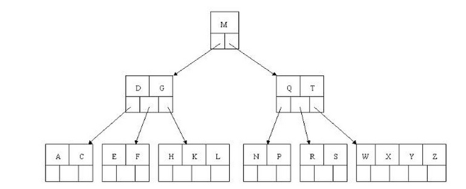
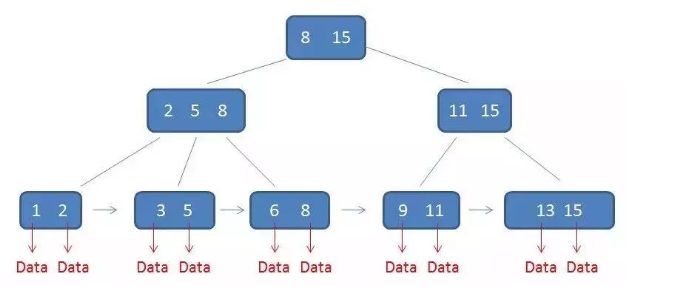
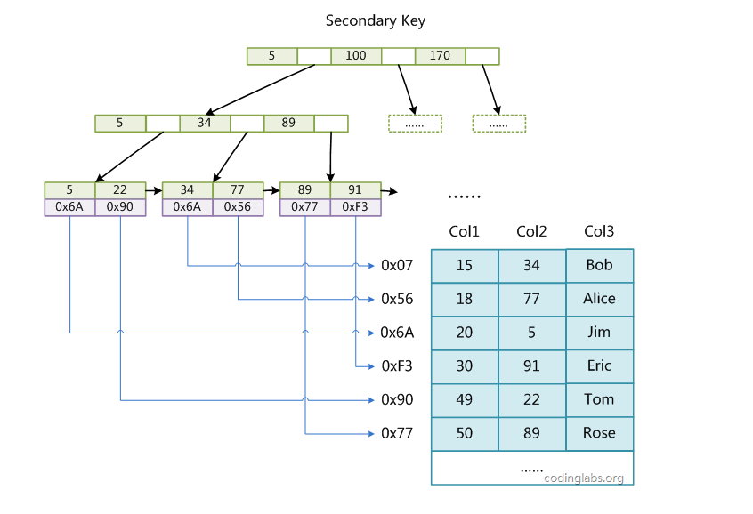
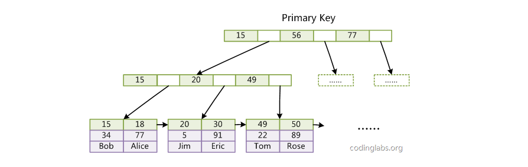
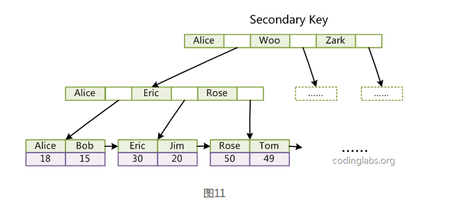
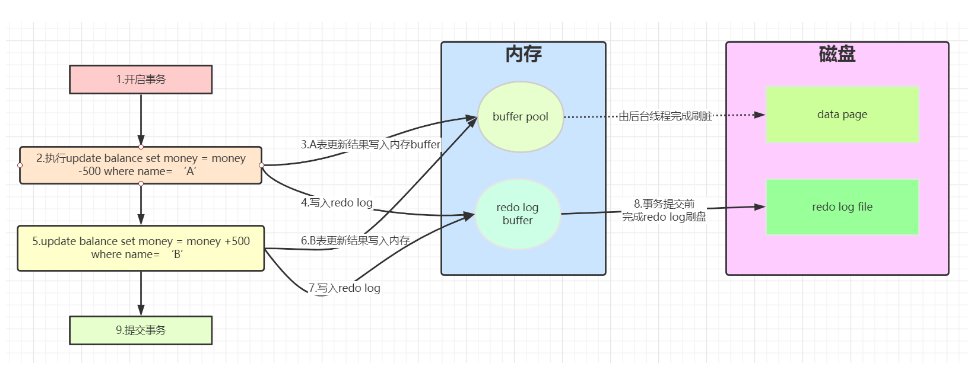

### 【8星】MySQL 为什么使用 B+ 树来作索引，对比 B 树它的优点和缺点是什么？ (times: 58)

+ B树（平衡多路搜索树）

  + 图示

    

  + 特征

    + 每个节点可有多棵子树
    + 每个非叶子节点有n个key，并有n+1棵子树（子树数量比key数量多1）
    + 每个节点中key都是从小到大排序的
    + 最左子树上的值都小于最左key的值，最右子树上的值都小于最右key的值，中间子树的值则位于相邻两个节点的值之间
    + 所有叶子节点都具有相同的深度

  + 查询伪代码

    ```js
    BTree_Search(node, key) {
        if(node == null) return null;
        foreach(node.key)
        {
            if(node.key[i] == key) return node.data[i];
                if(node.key[i] > key) return BTree_Search(point[i]->node);
        }
        return BTree_Search(point[i+1]->node);
    }
    data = BTree_Search(root, my_key);
    ```

  + 时间复杂度

    O(log n)

+ B+树

  + 图示

    

  + 特征

    + 子树与key的数量相同，节点的关键字为子树中的最大值
    + 非叶子节点不保存数据，仅用作索引，叶子节点保存全部数据
    + 所有叶子节点构成一个链表

  + 时间复杂度

    O(log n)

+ 局部性原理与磁盘预读

  + 局部性原理

    当一个数据被用到时，其附近的数据通常也会被用到

  + 磁盘预读

    + 磁盘不是按需读取，而是每次都会预读，即使只需要一个字节，磁盘也会从这个位置向后读取一定长度放到内存。
    + 预读的长度一般为页（页的大小通常为4k）的整数倍

+ mysql为什么使用B+树而不是B树作为索引？

  + 由于mysql通常将数据存放在磁盘中，读取数据就会产生磁盘IO消耗。而B+树的非叶子节点中不保存数据，B树中非叶子节点会保存数据，通常一个节点大小会设置为磁盘页大小，这样B+树每个节点可放更多的key，B树则更少。这样就造成了，B树的高度会比B+树更高，从而会产生更多的磁盘IO消耗。
  + B+树叶子节点构成链表，更利用范围查找和排序。而B树进行范围查找和排序则要对树进行递归遍历

+ B树与B+树比较

  + B+树层级更少，查找更快
  + B+树查询速度稳定：由于B+树所有数据都存储在叶子节点，所以查询任意数据的次数都是树的高度h
  + B+树有利于范围查找
  + B+树全节点遍历更快：所有叶子节点构成链表，全节点扫描，只需遍历这个链表即可
  + B树优点：如果在B树中查找的数据离根节点近，由于B树节点中保存有数据，那么这时查询速度比B+树快。

+ 为什么不使用红黑树（自平衡二叉搜索树）？

  如果使用红黑树，会使树的高度更高，增加IO消耗

+ 为什么不使用哈希表

  哈希表对于范围查找和排序效率低，但对于单个数据的查询效率很高。

+ 参考

  https://blog.codinglabs.org/articles/theory-of-mysql-index.html

### 【8星】数据库的事务隔离级别有哪些？各有哪些优缺点？ (times: 33)

+ 事务隔离级别主要有四种

  + 读未提交 (READ UNCOMMITED)
    + 定义：一个事务可以读取另一个事务已修改但未提交的数据
    + 存在的问题
      + 脏读
      + 不可重复读
      + 幻读
  + 读已提交 (READ COMMITED)
    + 定义：一个事务只能读取另一个事务已经提交的数据
    + 存在的问题
      + 不可重复读
      + 幻读
  + 可重复读 (REPEATABLE READ)（Mysql 默认隔离级别）
    + 定义：在一个事务中多次读取同一条记录，结果一致，无论其他事务是否对这条记录做了修改
    + 存在的问题
      + 幻读
  + 串行 (SERIALIZABLE)
    + 定义：所有事务顺序执行
    + 不存在脏读、不可重复读、幻读等问题

+ 释义

  + 脏读
    + 定义： 一个事务读到另一个事务已修改未提交的数据，如果前一个事务回滚，这个数据是错误的。或者在前一个事务修改之前读到了数据
  + 不可重复读
    + 定义：一个事务修改某一条数据，另一个事务在前一个事务提交之前读到的是修改前的数据，等前一个事务提交之后，读到的又是修改后的数据，造成两次读取同一条数据不一致
  + 幻读
    + 定义：某个表初始有三条数据，在一个事务中插入一条数据，另一个事务读到的也是三条数据，但是在前一个事务提交后，读到的应是4条。

+ 优缺点

  隔离级别从上到下，并发性能越来越差，但对于数据的隔离性一致性保证程度越好

+ 参考

  https://blog.csdn.net/qq_41907991/article/details/107717419?utm_source=app

  https://blog.csdn.net/u013256816/article/details/103966510?utm_source=app

### 【阿里】简述乐观锁以及悲观锁的区别以及使用场景 (times: 26)
### 【腾讯】什么是数据库事务，MySQL 为什么会使用 InnoDB 作为默认选项 (times: 25)
### 【腾讯】简述乐观锁以及悲观锁的区别以及使用场景 (times: 21)
### 【腾讯】什么情况下会发生死锁，如何解决死锁？ (times: 21)
### 【腾讯】Redis 有几种数据结构？Zset 是如何实现的？ (times: 21)
### 【阿里】简述一致性哈希算法的实现方式及原理 (times: 20)
### 【4星】聚簇索引和非聚簇索引有什么区别？什么情况用聚集索引？ (times: 19)

+ MyISAM索引实现

  + 使用B+树

  + 叶子节点的data域存储数据记录的地址（非聚簇索引）

  + 主键索引与普通索引结构一样

  + 查询数据时，首先找到data域中的地址，然后再根据地址去磁盘中读数据

  + 图示

    

+ InnoDB的索引实现

  + 使用B+树

  + 主键索引叶子节点data域保存着完整的数据记录（聚簇索引）

  + 普通索引叶子节点data域保存着主键值（非聚簇索引）

  + 每个表只能有一个聚簇索引

  + 主键索引查询数据，只需根据主键值拿到叶子节点中data域的数据即可。而对于普通索引查询数据时，首先找到叶子节点data域中的主键值，然后再去主键索引中根据主键值去查数据。

  + 图示

    + 主键索引

      

    + 辅助索引

      

  + 聚簇索引与非聚簇索引定义

    叶子节点data域保存完整数据记录的就是聚簇索引，叶子节点data域只保存主键值或数据地址的就是非聚簇索引

  + 什么是回表

    通过辅助索引查询到主键值后，再拿主键值去主键索引中查找数据的过程就叫做回表

  + 什么是索引覆盖

    + 当sql语句中的select列（查询的字段）和where列（条件字段）都在一个索引中，则不需要进行回表，这就是索引覆盖。
    + 例如：select id, name from users where name = 'jack'; (对name建立辅助索引)。这个示例中由于对name字段建立辅助索引，而辅助索引每个叶子节点的data域保存主键值，则不需要进行回表操作，即可拿到id和name。
    + 所有不需要回表的查询操作都是索引覆盖。
    + **可利用索引覆盖来减少IO操作**，从而提高查询效率。比如select id, name,age from users where name = 'jack'; 可对name和age建立联合索引，从而避免回表。

  + 什么是索引下推

    TODO

  + 为什么尽量使用短的字段作为索引

    + 由于每个B+树的节点大小是固定的，过大的字段会导致每个节点存储的key数量表少，从而使树的层级变高，增加IO消耗
    + 如果使用长的字段作为主键，则也会使辅助索引占用空间变大，因为辅助索引叶子节点data域存储的是主键值

  + 为什么尽量使用单调递增的字段作为主键

    非单调的主键会使在插入新数据时，为了维护B+树的特性而频繁的**分裂调整**，十分低效。

  + 如果没有设置主键，innodb会怎么处理？

    + 如果表定义了主键，则会以这个主键作为key，进行构建聚簇索引
    + 如果没有定义主键，则会选择一个唯一索引作为key，进行构建聚簇索引
    + 如果没有主键也没有唯一索引，那么就会创建一个隐藏的row-id作为key，进行构建聚簇索引。

  + 参考

    https://blog.codinglabs.org/articles/theory-of-mysql-index.html

    https://draveness.me/whys-the-design-mysql-b-plus-tree/

    https://www.jianshu.com/p/bdc9e57ccf8b

### 【美团】Redis 如何实现分布式锁？ (times: 19)
### 【美团】简述乐观锁以及悲观锁的区别以及使用场景 (times: 19)
### 【阿里】简述脏读和幻读的发生场景，InnoDB 是如何解决幻读的？ (times: 18)
### 【腾讯】简述脏读和幻读的发生场景，InnoDB 是如何解决幻读的？ (times: 18)
### 【美团】简述 MySQL 常见索引数据，介绍一下覆盖索引 (times: 17)
### 【美团】简述事务的四大特性 (times: 17)
### 【腾讯】唯一索引与普通索引的区别是什么？使用索引会有哪些优缺点？ (times: 17)
### 【京东】简述乐观锁以及悲观锁的区别以及使用场景 (times: 17)
### 【阿里】简述 Redis 持久化中 rdb 以及 aof 方案的优缺点 (times: 16)
### 【美团】简述 Redis 持久化中 rdb 以及 aof 方案的优缺点 (times: 14)
### 【美团】简述 Redis 的线程模型以及底层架构设计 (times: 14)
### 【阿里】什么情况下会发生死锁，如何解决死锁？ (times: 14)
### 【阿里】SQL优化的方案有哪些，如何定位问题并解决问题？ (times: 14)
### 【腾讯】简述 MySQL 的间隙锁 (times: 14)
### 【美团】为什么 Redis 在单线程下能如此快？ (times: 14)
### 【字节跳动】Redis 序列化有哪些方式？ (times: 13)
### 【Shopee】简述乐观锁以及悲观锁的区别以及使用场景 (times: 13)
### 【美团】简述脏读和幻读的发生场景，InnoDB 是如何解决幻读的？ (times: 13)
### 【百度】什么是数据库事务，MySQL 为什么会使用 InnoDB 作为默认选项 (times: 13)
### 【腾讯】简述 Redis 持久化中 rdb 以及 aof 方案的优缺点 (times: 13)
### 【百度】联合索引的存储结构是什么？ (times: 13)
### 【字节跳动】简述 Redis 持久化中 rdb 以及 aof 方案的优缺点 (times: 12)
### 【字节跳动】Redis 如何实现分布式锁？ (times: 12)
### 【字节跳动】简述 Redis 的哨兵机制 (times: 12)
### 【滴滴】联合索引的存储结构是什么？ (times: 11)
### 【腾讯】Redis 如何实现延时队列，分布式锁的实现原理 (times: 11)
### 【京东】什么情况下会发生死锁，如何解决死锁？ (times: 11)
### 【字节跳动】简述 Redis 中如何防止缓存雪崩和缓存击穿 (times: 11)
### 【Shopee】为什么 Redis 在单线程下能如此快？ (times: 11)
### 【美团】简述 Redis 的过期机制和内存淘汰策略 (times: 11)
### 【美团】简述 Redis 如何处理热点 key 访问 (times: 10)
### 【美团】简述 Redis 的哨兵机制 (times: 10)
### 【美团】简述 Redis 中如何防止缓存雪崩和缓存击穿 (times: 9)
### 【百度】redis 如何实现高可用？ (times: 9)
### 【百度】简述乐观锁以及悲观锁的区别以及使用场景 (times: 9)
### 【阿里】Redis的缓存淘汰策略有哪些？ (times: 9)
### 【美团】什么是数据库事务，MySQL 为什么会使用 InnoDB 作为默认选项 (times: 9)
### 【腾讯】简述 Redis 中如何防止缓存雪崩和缓存击穿 (times: 9)
### 【京东】数据库索引的实现原理是什么？ (times: 8)
### 【美团】MySQL 有哪些常见的存储引擎？ (times: 8)
### 【腾讯】MySQL 有什么调优的方式？ (times: 8)
### 【滴滴】数据库如何设计索引，如何优化查询？ (times: 8)
### 【快手】简述什么是最左匹配原则 (times: 8)
### 【腾讯】简述 MySQL 的主从同步机制，如果同步失败会怎么样？ (times: 7)
### 【快手】Redis 如何实现分布式锁？ (times: 7)
### 【京东】简述 Redis 持久化中 rdb 以及 aof 方案的优缺点 (times: 7)
### 【字节跳动】简述乐观锁以及悲观锁的区别以及使用场景 (times: 7)
### 【快手】MySQL 联合索引底层原理是什么？ (times: 7)
### 【快手】什么情况下会发生死锁，如何解决死锁？ (times: 7)
### 【美团】B+ 树叶子节点存储的是什么数据 (times: 7)
### 【滴滴】简述 Redis 中如何防止缓存雪崩和缓存击穿 (times: 6)
### 【百度】简述 MySQL 三种日志的使用场景 (times: 6)
### 【百度】简述 redis 的通信模型 (times: 6)
### 【字节跳动】简述脏读和幻读的发生场景，InnoDB 是如何解决幻读的？ (times: 6)
### 【美团】简述什么是最左匹配原则 (times: 6)
### 【字节跳动】数据库有哪些常见索引？数据库设计的范式是什么？ (times: 6)
### 【京东】简述什么是最左匹配原则 (times: 6)
### 【京东】简述 Redis 中常见类型的底层数据结构 (times: 6)
### 【阿里】简述什么是最左匹配原则 (times: 6)
### 【阿里】简述数据库中什么情况下进行分库，什么情况下进行分表？ (times: 6)
### 【美团】简述 Redis 中常见类型的底层数据结构 (times: 6)
### 【京东】MySQL 常用的聚合函数有哪些？ (times: 6)
### 【腾讯】MySQL 的索引什么情况下会失效？ (times: 6)
### 【京东】MySQL 联合索引底层原理是什么？ (times: 5)
### 【Shopee】什么情况下会发生死锁，如何解决死锁？ (times: 5)
### 【快手】简述常见的负载均衡算法 (times: 5)
### 【4星】简述数据库中的 ACID 分别是什么？ (times: 5)

+ ACID

  + 原子性
    + 定义：每个事务都是不可分割的最小工作单元，事务中的所有操作要么全成功，要么全失败
  + 一致性
    + 定义：比如A向B转账，A减少1000，B就得增加1000，两人的余额总和不能变
  + 隔离性
    + 定义：各个事务之间相互隔离，互不干扰
  + 持久性
    + 定义：事务一旦提交，数据会永久的存储在数据库中

+ 实现原理

  + redo log

    + 定义： 包含redo log buffer（内存）和redo log file（磁盘），**记录事务执行过程中数据修改后物理数据页面的信息**。后台线程会将buffer中的数据同步到磁盘。

    + 流程图

      

    + 作用

      + 当mysql宕机时，如果buffer中还有数据没有同步到磁盘，可通过redo log 进行恢复（所以叫重做日志）。
      + 确保事务的**持久性**

    + 什么时候开始写redolog？什么时候释放redolog？

      + 当事务开始时就会写redolog
      + 当buffer中的数据页同步到磁盘后，redolog就会被释放重用。

    + 既然写redolog也有磁盘IO消耗，为什么不直接将数据写入磁盘呢？

      + 直接写磁盘是随机IO，写redolog是顺序IO，顺序IO比随机IO性能好。
      + 因为mysql加载数据到内存，最小单位是页，所以即使有很小的改动，也会将整页更新，造成大量无效IO。而redolog只包含真正要写入的部分

  + undo log

    + 定义：记录数据被修改前的信息（记录**逆操作**），用于回滚操作
    + 作用
      + 用于回滚事务的操作
      + 保证事务的**原子性**

  + 读写锁

    + 读锁（共享锁）
      + 定义：多个事务可以并发的读同一条数据，但不能同时写同一条数据
    + 写锁（排它锁）
      + 定义：一个事务拿到写锁之后，其他事务不能读也不能写这条数据

  + MVCC（Multi-Version Concurrency Control）多版本并发控制

    + 隐藏字段（mysql在创建表时，会为每张表创建几个隐藏字段）

      + row_id：行记录的唯一标志
      + transaction_id：事务id
      + roll_pointer：回滚指针，指向对应的undo log，用于回滚。

    + 作用

      + 提高并发性能，不需要加锁，处理读写冲突，利于读多写少的场景

    + 原理

      + 同一份数据为每个事务生成一个版本（由隐藏字段实现），每个事务只能读特定版本的数据（类似快照）
      + 不需要使用锁
      + 读与读之间不影响

      

### 【京东】什么是 SQL 注入攻击？如何防止这类攻击？ (times: 5)
### 【阿里】数据库索引的实现原理是什么？ (times: 5)
### 【京东】数据库有哪些常见索引？数据库设计的范式是什么？ (times: 5)
### 【腾讯】Kafka 发送消息是如何保证可靠性的？ (times: 4)
### 【快手】Redis 有几种数据结构？Zset 是如何实现的？ (times: 4)
### 【阿里】为什么 Redis 在单线程下能如此快？ (times: 4)
### 【字节跳动】Redis 有几种数据结构？Zset 是如何实现的？ (times: 4)
### 【字节跳动】Cookie和Session的关系和区别是什么？ (times: 4)
### 【字节跳动】Redis 中 key 的过期策略有哪些？ (times: 4)
### 【字节跳动】简述 Redis 中常见类型的底层数据结构 (times: 4)
### 【百度】什么情况下会发生死锁，如何解决死锁？ (times: 4)
### 【Shopee】数据库有哪些常见索引？数据库设计的范式是什么？ (times: 3)
### 【字节跳动】并发事务会引发哪些问题？如何解决？ (times: 3)
### 【字节跳动】简述 MySQL 三种日志的使用场景 (times: 3)
### 【滴滴】Redis 如何实现分布式锁？ (times: 3)
### 【腾讯】简述 Redis 中跳表的应用以及优缺点 (times: 3)
### 【Shopee】数据库的读写分离的作用是什么？如何实现？ (times: 3)
### 【阿里】数据库查询中左外连接和内连接的区别是什么？ (times: 3)
### 【字节跳动】什么情况下会发生死锁，如何解决死锁？ (times: 3)
### 【Shopee】简述 SQL 中左连接和右连接的区别 (times: 3)
### 【字节跳动】MySQL 中 join 与 left join 的区别是什么？ (times: 2)
### 【阿里】数据库的读写分离的作用是什么？如何实现？ (times: 2)
### 【滴滴】假设建立联合索引 (a, b, c) 如果对字段 a 和 c 查询，会用到这个联合索引吗？ (times: 2)
### 【Shopee】Redis 中，sentine l和 cluster 的区别和适用场景是什么？ (times: 2)
### 【阿里】简述 Redis 中跳表的应用以及优缺点 (times: 2)
### 【Shopee】什么是数据库事务，MySQL 为什么会使用 InnoDB 作为默认选项 (times: 2)
### 【快手】如何解决 TCP 传输丢包问题？ (times: 2)
### 【阿里】Redis 中，sentine l和 cluster 的区别和适用场景是什么？ (times: 1)
### 【字节跳动】模糊查询是如何实现的？ (times: 1)
### 【腾讯】假设Redis 的 master 节点宕机了，你会怎么进行数据恢复？ (times: 1)
